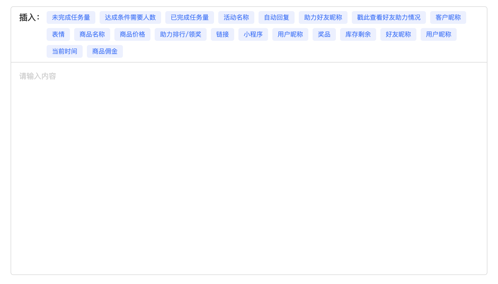

# c-editor

## 写在前面

因为工作需要写一个编辑器，核心是要在给后端的数据中插入后端需要的字段，方便替换数据，找了半天没找到合适的开源库，只能自己支持。
用的是原生的`contenteditable`，本文记录了基本使用方法以及具体功能的实现。

## 实现功能

- 支持工具栏工具选用

- 支持插入emoji表情，组件中维护了一批emoji表情

- 支持调整编辑区域高度、编辑区域占位文本以及输入文本颜色

- 支持设置初始化内容

- 支持禁用

- 支持粘贴

- 支持最大输入长度以及显示输入字数

- 支持某些工具的触发方式支持单独配置

- 提供读取html以及text方法

## 组件界面展示



## 具体实现

### contenteditable

编辑区域设置`contenteditable="true"`，插入的内容设置`contenteditable="false"`

```html
<!-- 编辑区域 -->
<div contenteditable="true"></div>
```

```html
<!-- 插入内容 -->
<span class="editor-insert-item" contenteditable="false" data-type="checkTheHelpOfFriends">
  [戳此查看好友助力情况]
</span>
```

### placeholder

placeholder，不要写在content里面，用样式empty来设置，否则插入组件之后，删除会自动清空。

```css
&:empty::before{
  content: attr(placeholder);
  font-size: 14px;
  color: #CCC;
  line-height: 21px;
  padding-top: 10px;
}
```

### 内容插入

所有工具在插入时都会插入一个`span`标签，并且`data-type`属性会记录工具类型，在工具选中时会根据`data-type`属性来判断是否是当前工具，如果是则触发相应工具的编辑。格式如下：

```html
<span class="editor-insert-item" contenteditable="false" data-type="工具类型">
  插入文案
</span>
```
组件中提供了统一的方法用来生成该结构：

```js
export function createElement ({ 
  type, 
  tagName = 'span', 
  classList = '', 
  innerHTML = '', 
  attribute = {}, 
  dataset = {} 
}, isLink = true) {
  const linkClassName = 'f-csp editor-insert-item editor-insert-item-link';
  const normalClassName = 'editor-insert-item';
  let resultClassList = isLink ? `${linkClassName} ${classList}` : `${normalClassName} ${classList}`;
  const contentElement = document.createElement(tagName);
  contentElement.classList = resultClassList;
  contentElement.innerHTML = innerHTML;
  for (const [key, value] of Object.entries(attribute)) {
    contentElement.setAttribute(key, value);
  }
  for (const [key, value] of Object.entries(dataset)) {
    contentElement.setAttribute(`data-${key}`, value);
  }
  contentElement.setAttribute('contenteditable', false);
  contentElement.setAttribute('data-type', type);
  return contentElement;
}
```

### 光标位置

#### 记录光标位置

该功能最核心的就是记录光标最后的位置，在编辑区域聚焦、失焦或者点击时都需要几率光标的位置。
因为某些工具插入的内容支持修改，所以再点击编辑区域时要判断是否是修改内容，如果是修改内容，则出发相应工具的编辑，这时就不需要去记录光标的位置了。

```js
/**
 * 获取光标位置
 */
handleSetLastEditRange () {
  const selection = window.getSelection();
  if (!selection.focusNode) return;
  const range = selection.getRangeAt(0);
  const preSelectionRange = range.cloneRange();
  const { nextSibling, parentNode } = preSelectionRange.startContainer;
  /**
   * 如果没有相邻右节点并且父节点的标签名为 SPAN
   * 则说明当前编辑区域内容为空 or 最后的内容是不可编辑节点
   * 这时需要把光标放在最后
   */
  if (!nextSibling && parentNode.nodeName === 'SPAN') {
    range.selectNodeContents(this.$refs.editorArea);
    range.collapse(false);
    selection.removeAllRanges();
    selection.addRange(range);
    return;
  }
  this.lastEditRange = preSelectionRange;
}
```

#### 移动光标

如果编辑区域内有内容，在元素插入后，需要将光标移动到该元素之后

```js
const selection = getSelection();
selection.removeAllRanges();
selection.addRange(this.lastEditRange);
const range = selection.getRangeAt(0);
range.insertNode(html);
// 把光标移动插入元素之后
if (html) {
  range.setStartAfter(html);
}
// 光标开始和光标结束重叠
range.collapse(true);
// 清除选定对象的所有光标对象
selection.removeAllRanges();
// 插入新的光标对象
selection.addRange(range);
```

### 内容粘贴

对于粘贴进编辑区域的内容，统一处理成纯文本格式，用css控制即可。
```js
handlePaste (event) {
  if (!this.maxlength) return
  const clipboardData = event.clipboardData || window.clipboardData
  const pastedText = clipboardData.getData('text/plain')
  const content = event.target.innerText
  const contentLength = content.length
  const selectedText = this.getSelectedTextByElement(this.$refs.editorArea)
  const allowedPasteLength = this.maxlength - contentLength + selectedText.length
  const slicedPasteText = pastedText.substring(0, allowedPasteLength)

  event.preventDefault()
  document.execCommand('insertHTML', false, slicedPasteText)
},
```

```css
-webkit-user-modify: read-write-plaintext-only;
user-modify: read-write-plaintext-only;
```